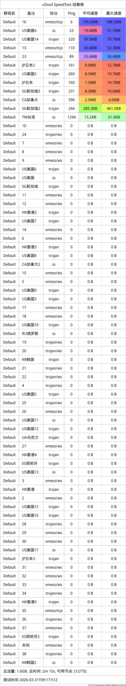

# fly
# 不定时更新
所有免费节点都爬取自网络，请勿用于非法用途  
|  工具  | Android  | Windows  |  
|  ----  | ----   | ----  |  
| v2ray  | [v2rayNG](https://github.com/2dust/v2rayNG/releases) | [v2rayN](https://github.com/2dust/v2rayN/releases) |  
| Clash  | - | [Clash For Windows](https://github.com/2dust/clashN/releases) | 
  
### 节点更新订阅  v2ray
- `https://raw.githubusercontent.com/ts-sf/fly/main/v2`  
- `https://mirror.v2gh.com/https://raw.githubusercontent.com/ts-sf/fly/main/v2`  

#### 部分节点  
``` 
ss://Y2hhY2hhMjAtaWV0Zi1wb2x5MTMwNTp0MHNybWR4cm0zeHlqbnZxejlld2x4YjJteXE3cmp1dg==@52.195.228.139:2377#%E6%9C%AA%E7%9F%A52
trojan://Aimer@172.67.149.185:443?sni=epccg.ambercc.filegear-sg.me#%E6%9C%AA%E7%9F%A53
trojan://55af195e-105f-4efc-871b-6eccb3163214@162.159.153.2:443?security=tls&type=ws&sni=ft-champions-coupons-relate.trycloudflare.com&host=ft-champions-coupons-relate.trycloudflare.com#%E6%9C%AA%E7%9F%A54
trojan://8QOe%29%26jIP%5E%5Dl%7BP.1@172.66.44.182:443?security=tls&type=ws&sni=JoInMAHdisErVER-78D.PaGEs.DEV&host=joinmahdiserver-78d.pages.dev#%E6%9C%AA%E7%9F%A55
trojan://auto@104.21.31.51:443?security=tls&type=ws&sni=esetsecuritylicense1.vowexa5791.workers.dev&path=/&host=esetsecuritylicense1.vowexa5791.workers.dev#%E6%9C%AA%E7%9F%A56
```
### 节点更新订阅  clash
- `https://raw.githubusercontent.com/ts-sf/fly/main/clash`  
- `https://mirror.v2gh.com/https://raw.githubusercontent.com/ts-sf/fly/main/clash`  

### 节点测速结果

