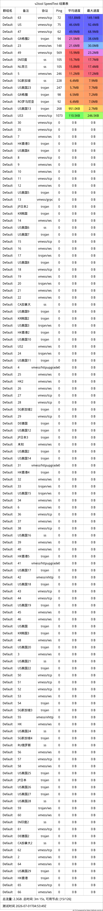

# fly
# 不定时更新
所有免费节点都爬取自网络，请勿用于非法用途  
|  工具  | Android  | Windows  |  
|  ----  | ----   | ----  |  
| v2ray  | [v2rayNG](https://github.com/2dust/v2rayNG/releases) | [v2rayN](https://github.com/2dust/v2rayN/releases) |  
| Clash  | - | [Clash For Windows](https://github.com/2dust/clashN/releases) | 
  
### 节点更新订阅  v2ray
- `https://raw.githubusercontent.com/ts-sf/fly/main/v2`  
- `https://mirror.v2gh.com/https://raw.githubusercontent.com/ts-sf/fly/main/v2`  

#### 部分节点  
``` 
trojan://trojan@109.234.211.66:2087?sni=store.timimi.dpdns.org#%F0%9F%87%BA%F0%9F%87%B8US%E7%BE%8E%E5%9B%BD
trojan://humanity@188.114.98.0:443?security=tls&type=ws&sni=www.calmlunch.com&path=/assignment&host=www.calmlunch.com#%E6%9C%AA%E7%9F%A5
trojan://9f7d5cb76d1645101994d9b25891e3b7@52.192.219.241:3700?sni=www.nintendogames.net#%F0%9F%87%BA%F0%9F%87%B8US%E7%BE%8E%E5%9B%BD2
trojan://humanity@104.18.11.110:443?security=tls&type=ws&sni=www.multiplydose.com&path=/assignment#%E6%9C%AA%E7%9F%A52
trojan://Aimer@167.68.4.199:2053?sni=epge.muarua.filegear-sg.me#%F0%9F%87%BA%F0%9F%87%B8US%E7%BE%8E%E5%9B%BD3
```
### 节点更新订阅  clash
- `https://raw.githubusercontent.com/ts-sf/fly/main/clash`  
- `https://mirror.v2gh.com/https://raw.githubusercontent.com/ts-sf/fly/main/clash`  

### 节点测速结果

